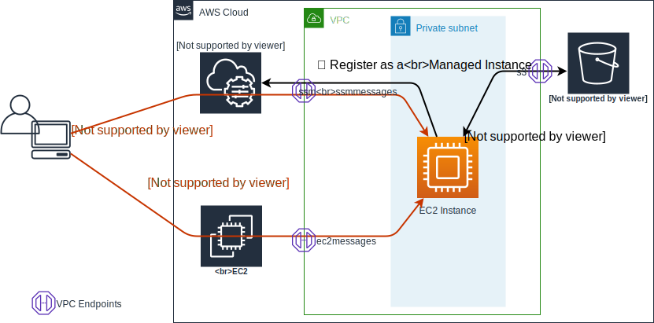
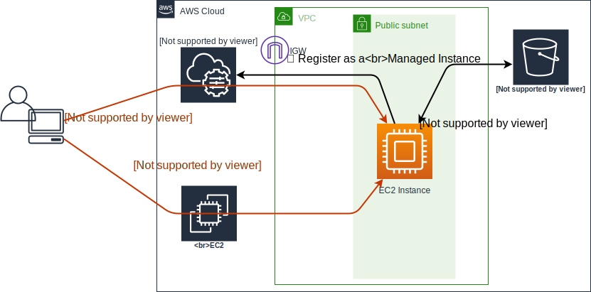

This solution demonstrates how to access over SSH an EC2 instance
having no SSH key installed on it,
no ports open,
even no public IP address configured.

# How it works

We leverage Amazon EC2 Instance Connect for 'injecting' a temporal SSH key we generate into the instance.

For connecting the instance, we make use of AWS Systems Manager Session Manager configuring SSH client with a specific ProxyCommand.

You can use this demo in two modes. The 'advanced' one creates a private subnet,
which requires creating four VPC Endpoints in order to allow the EC2 instance to connect AWS services,
namely SSM, EC2 and S3.

> **Important!** Three of the endpoints are of Interface type powered by [AWS PrivateLink](https://aws.amazon.com/privatelink/). Creating Interface endpoints incurs **additional costs**. Please refer to [AWS PrivateLink pricing](https://aws.amazon.com/privatelink/pricing/).

Another mode creates a public subnet and an EC2 instance in it with a public IP address.
In this mode it still doesn't open port 22, or any other port.

# References

[AWS Systems Manager Session Manager for Shell Access to EC2 Instances](https://aws.amazon.com/blogs/aws/new-session-manager/), updated in August 2019, on AWS News Blog,
and [Enable SSH Connections Through Session Manager](https://docs.aws.amazon.com/systems-manager/latest/userguide/session-manager-getting-started-enable-ssh-connections.html) on AWS Systems Manager User Guide.

[Introducing Amazon EC2 Instance Connect](https://aws.amazon.com/about-aws/whats-new/2019/06/introducing-amazon-ec2-instance-connect/) published on Jun 27, 2019 on What's New,
and [Connect Using EC2 Instance Connect](https://docs.aws.amazon.com/AWSEC2/latest/UserGuide/ec2-instance-connect-methods.html) on Amazon EC2 User Guide.

[ProxyCommand](https://man.openbsd.org/ssh_config#ProxyCommand)
on OpenSSH SSH client configuration files man page.

# Architecture

## EC2 Instance in a Private Subnet


## EC2 Instance in a Public Subnet


# How to deploy

1. If required, update aws cli to newer version supporting
[ec2-instance-connect](https://docs.aws.amazon.com/cli/latest/reference/ec2-instance-connect/index.html) service.

1. Create an AWS CloudFormation stack providing ```CloudFormation template.yaml``` file as the template.

1. Make a note of the EC2 instance's id on the stack's outputs.

1. (Optional) Observe in AWS Systems Manager console if the instance appeared among Managed Instances.

1. Update SSM Agent on the instance if required. It [must be](https://docs.aws.amazon.com/systems-manager/latest/userguide/session-manager-getting-started-enable-ssh-connections.html) of version 2.3.672.0 or later.
<br/>You can use following command to update SSM Agent.
<br/>```aws ssm create-association --name AWS-UpdateSSMAgent --instance-id ...```

1. Add content of SSH config snippet provided here to your ~/.ssh/config. You can do that with following command.
<br/>```cat ./.ssh/config >>~/.ssh/config```

# How to use

Connect the instance with following command providing your instance id.
<br/>```./connect.sh ec2-user@i-xxxxxxxxxxxxx```
